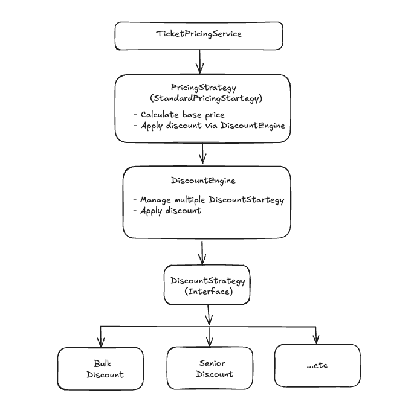

# Cinema Ticket Pricing API

A RESTful API for calculating cinema ticket prices with support for multiple ticket types, age-based pricing and bulk discounts.

## Technology Stack

- **Java 21**
- **Spring Boot 3.3.5**
- **Gradle**
- **OpenAPI Generator** (API-first development)
- **Lombok**
- **JUnit 5 & MockMvc**


## Prerequisites

- Java 21 or higher
- Gradle 8.x (or use included Gradle wrapper)

## Getting Started

### 1. Clone the repository

```bash
git clone git@github.com:balamurugan-venkadachalam/cinema-pricing-service.git
cd cinema-pricing-service
```

### 2. Build the project

```bash
./gradlew clean build
```

### 3. Run the application
```bash
./gradlew bootRun
```
The application will start on http://localhost:8080

### 4. Access the Swagger UI
```aiexclude
http://localhost:8080/swagger-ui/index.html
```

### 5. Using IntelliJ IDEA HTTP Client ⚡ (Recommended)

IntelliJ IDEA provides a built-in HTTP client for testing REST APIs directly from the IDE.

**HTTP Request File:** `http-requests/ticket-pricing.http`

**How to Use:**

1. **Open the HTTP file:**
    - Run the application
    - Open IntelliJ IDEA
    - Navigate to `http-requests/ticket-pricing.http`

2. **Run a request:**
    - Click the ▶️ icon next to any request

## Configuration

Edit `src/main/resources/application.yml` to customize:

```yaml
pricing:
  # Base prices
  adult-base-price: 25.00
  senior-base-price: 25.00
  teen-base-price: 12.00
  children-base-price: 5.00
  
  # Bulk discounts
  bulk-discounts:
    - ticket-type: children
      quantity: 3
      rate: 0.25  # 25% off
```

### Class Diagram


 
## TODO
- Authentication & Authorization
- OAuth2 Authentication
- Docker
- Docker Compose
- Kubernetes
- CI/CD
- Logging and Tracing
- Monitoring

